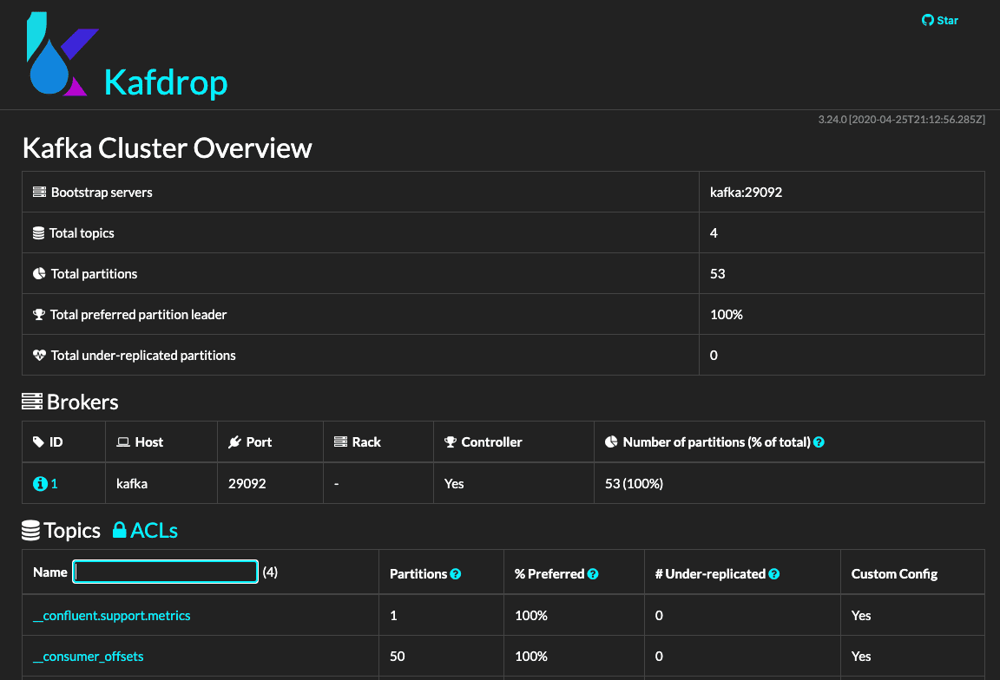
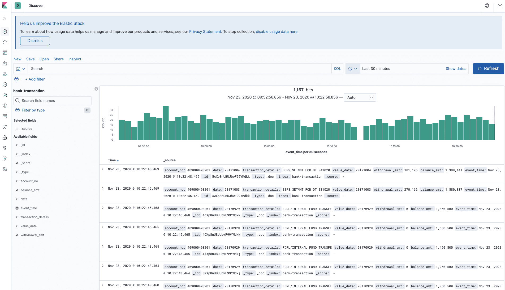

# Structured Streaming

## Prerequisite

```sh
pip install -r docs/requirements.txt
```

## 環境

- kafka
- kafdrop

    [http://localhost:9000/](http://localhost:9000/)
    

- elasticsearch (7.5.0)
- kibana (7.5.0)

    [http://localhost:5601/](http://localhost:5601/)
    

---

- START

    ```sh
    cd env
    docker-compose up -d
    ```

- STOP

    ```sh
    cd env
    docker-compose down
    ```

---

設定 `elasticsearch mapping`

```txt
PUT bank-transaction
{
  "mappings": {
    "properties": {
      "event_time": {
        "type": "date"
      }
    }
  }
}
```

## 測試

### Data

`source/bank-transaction.csv`

```txt
Account No,DATE,TRANSACTION DETAILS,CHQ.NO.,VALUE DATE,WITHDRAWAL AMT,DEPOSIT AMT,BALANCE AMT
409000611074',29-Jun-17,TRF FROM  Indiaforensic SERVICES,,29-Jun-17,,"1,000,000","1,000,000"
409000611074',5-Jul-17,TRF FROM  Indiaforensic SERVICES,,5-Jul-17,,"1,000,000","2,000,000"
409000611074',18-Jul-17,FDRL/INTERNAL FUND TRANSFE,,18-Jul-17,,"500,000","2,500,000"
...
```

### 情境一：從 `Kafka` 讀取資料，並以 `Account No` 計算一段時間的次數，將結果寫入 `Kafka`

`streaming-processor-count.py`

### 情境二：從 `Kafka` 讀取資料，將資料寫入 `elasticsearch`

`streaming-processor-filter.py`
